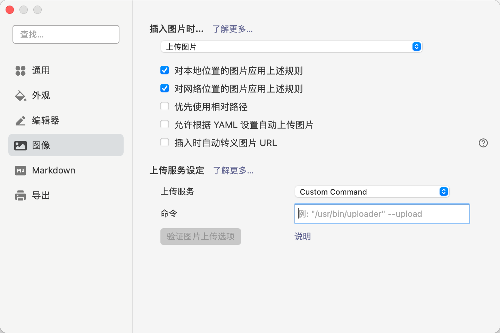
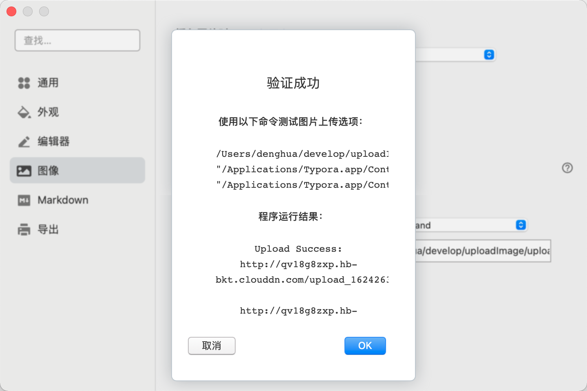

# typora最小的定制图床

## typora定制命令

想要好好用typora,  上传图片,那是必须要用的. 

但ipic 收费, 其他的安装包几十M. 为什么要搞这么复杂呢? 命令行不香么?

但真没什么人做这个东西. 先写个简单的吧. 利用七牛的python SDK. 写个命令行.

## 安装前提

使用python3. 使用conda管理python版本.

conda 建一个名为python3.8的空间.

pip install qiniu

## 配置

打开qiniu.properties

填写好需要的几个值.

## 使用

typero的配置中.  修改成如下的方式. 然后在命令中填好命令的位置.

点击“验证图片上传选项” 按钮.  出现如下信息,便成功了:

